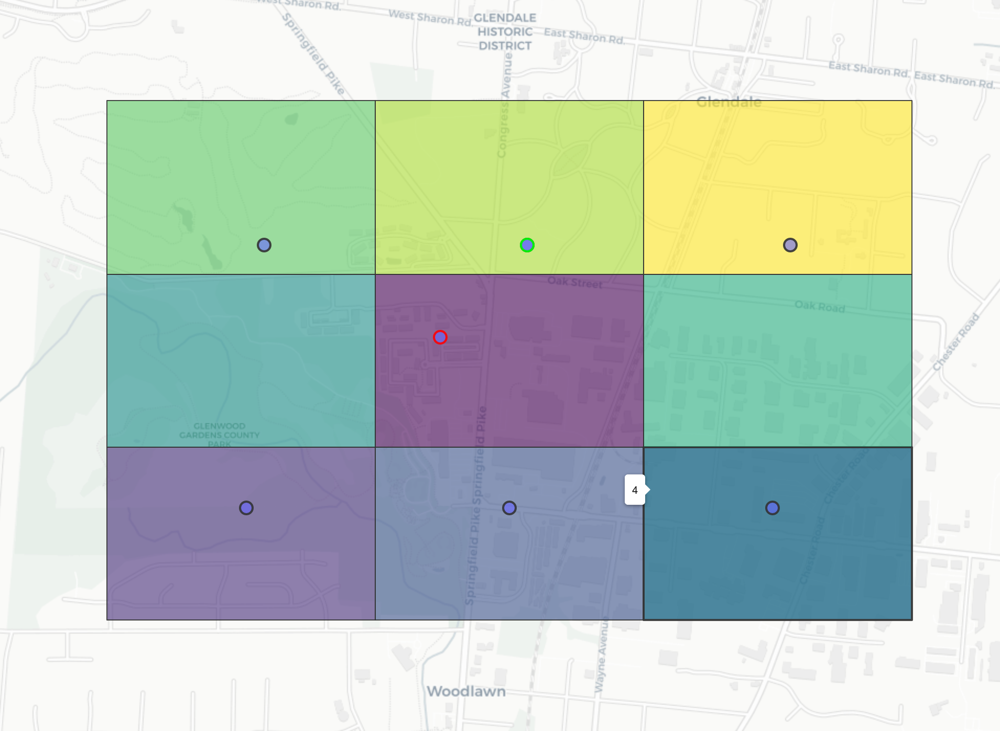

# schwartz_grid_lookup

> given a lat/lon coordinate, this DeGAUSS container returns a `site_index` and a `SiteCode`, which are values specifying the nearest "grid" centroid point for the Schwartz spatiotemporal pollutant models

[](https://hub.docker.com/repository/docker/degauss/schwartz_grid_lookup/tags)
[](https://github.com/degauss-org/schwartz_grid_lookup/releases)

## DeGAUSS example call

```sh
docker run --rm -v $PWD:/tmp degauss/schwartz_grid_lookup:0.2 my_address_file_geocoded.csv
```

## geomarker methods

- the red dot below is the query point
- its surrounding box is what is was geohashed to (precision = 6)
- neighboring boxes are added
- schwartz "grid" points that are geohashed within these boxes are extracted
- the index of the point closest to the query point, based on the great circle distance, is returned (highlighted in green)



## geomarker data

- script relies on [`schwartz_grid_geohashed.rds`](https://geomarker.s3.us-east-2.amazonaws.com/schwartz/schwartz_grid_geohashed.rds), which is made by running `01_geohash_schwartz_grid.R` on [`USGridSite.rds`](https://geomarker.s3.us-east-2.amazonaws.com/schwartz/USGridSite.rds) (originally retrieved from Google Drive share by QD)
